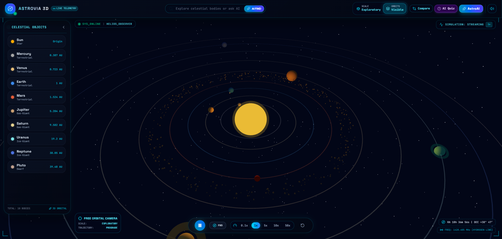
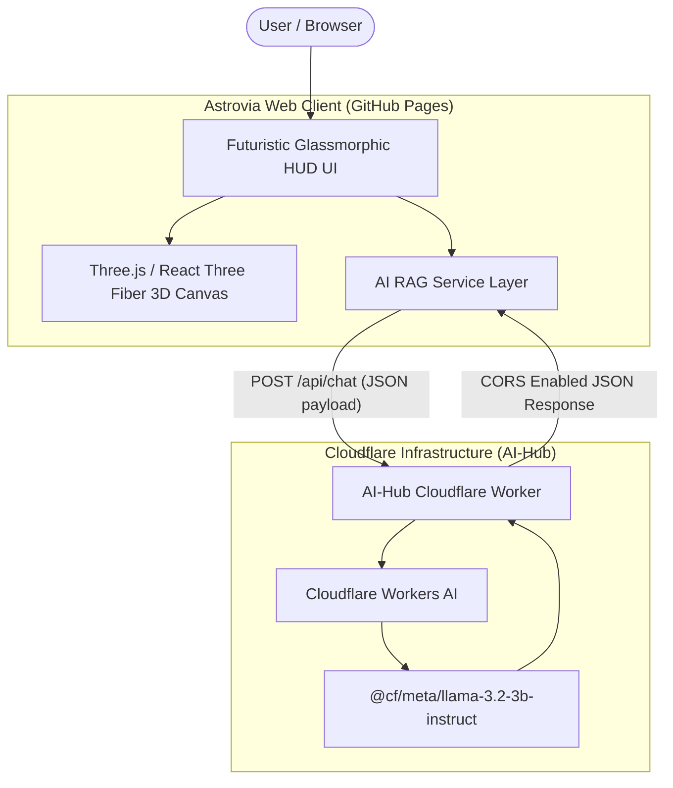

# 🌌 Astrovia — 3D Solar System Explorer

[](https://imtiazaly.github.io/Astrovia-3D-Solar-System-Explorer/)
[](https://react.dev/)
[](https://www.typescriptlang.org/)
[](https://threejs.org/)
[](https://ai.cloudflare.com/)

A hyper-realistic, interactive 3D Solar System Explorer built with **React 19**, **Three.js / React Three Fiber**, **Tailwind CSS**, and an integrated **AI Microservices Copilot** powered by **Cloudflare Workers AI** (`@cf/meta/llama-3.2-3b-instruct`).

---

## 📸 Project Preview



---

## 🚀 Live Links

- 🌐 **Web Application**: [https://imtiazaly.github.io/Astrovia-3D-Solar-System-Explorer/](https://imtiazaly.github.io/Astrovia-3D-Solar-System-Explorer/)
- ⚡ **Production AI Endpoint**: [https://ai-hub.imtiyazalye.workers.dev/api/chat](https://ai-hub.imtiyazalye.workers.dev/api/chat)

---

## ✨ Key Features

### 🎨 1. Immersive 3D Graphics & Physics Engine
- **Procedural Orbits & Lighting**: Real-time rendering of planetary orbits, axial rotations, procedural particle asteroid belts, and illuminated Sun point lights.
- **Dynamic Camera Fly-To**: Smooth OrbitControls camera transitions with focal target tracking when inspecting celestial bodies.
- **Time Controls**: Control orbital speeds with real-time play, pause, reverse, and speed multipliers (`0.25x` to `10x`).

### 🤖 2. AstroAI Astrophysics Copilot & RAG Engine
- **Cloudflare Workers AI Backend**: Zero-friction AI integration without requiring visitors to enter API keys.
- **RAG Ground-Truth Architecture**: Grounded with NASA's astrophysics dataset for accurate numbers (temperatures, orbital periods, natural moon counts).
- **Multilingual Natural Language Search**: Handles complex sentence queries in any language (e.g., *"sub sy door planet dikhao"*, *"hottest planet"*, *"red planet"*) and automatically focuses the 3D camera.

### 📊 3. Planetary Telemetry & Comparison System
- **Detailed Inspection Drawer**: View real-time orbital specs, atmospheric composition, surface temperatures, gravity, and fun facts.
- **Side-by-Side Comparison**: Select any two planets to compare radius, mass, distance from Sun, moons, and temperature differences.
- **Text-to-Speech (TTS) Reader**: Built-in speech synthesis to listen to telemetry reports hands-free.

### 🎮 4. Interactive AI Space Trivia Quiz
- **Dynamic AI Trivia**: Synthesizes real astrophysics multiple-choice quiz questions on the fly.
- **Confetti & Scoring**: Real-time score tracking, immediate feedback explanations, and victory celebration effects.

---

## 🛠️ System Architecture



---

## 🧰 Tech Stack

| Domain | Technology / Library |
| :--- | :--- |
| **Frontend Framework** | React 19, TypeScript, Vite |
| **3D Rendering** | Three.js, `@react-three/fiber`, `@react-three/drei` |
| **Styling & HUD** | Tailwind CSS, Lucide Icons, Custom Glassmorphism CSS |
| **AI Backend Microservice** | Cloudflare Workers AI (`ai-hub.imtiyazalye.workers.dev`) |
| **AI Model** | `@cf/meta/llama-3.2-3b-instruct` |
| **Audio & SFX** | Web Audio API Engine, Web Speech API (TTS) |
| **Deployment** | GitHub Pages (Client) + Cloudflare Workers (AI Microservice) |

---

## 📦 Local Setup & Development

Follow these steps to run Astrovia locally on your machine:

### 1. Clone the Repository
```bash
git clone https://github.com/imtiazaly/Astrovia-3D-Solar-System-Explorer.git
cd Astrovia-3D-Solar-System-Explorer
```

### 2. Install Dependencies
```bash
npm install
```

### 3. Run Development Server
```bash
npm run dev
```
Open [http://localhost:5173](http://localhost:5173) in your browser to view the application.

### 4. Build for Production
```bash
npm run build
```

---

## 📂 Directory Structure

```text
Astrovia-3D-Solar-System-Explorer/
├── src/
│   ├── assets/              # Static assets & preview images (Astrovia.PNG)
│   ├── components/
│   │   ├── 3d/              # Three.js 3D canvas, planets, rings, asteroid belts
│   │   └── ui/              # HUD overlay, AiChatAssistant, SettingsModal, QuizModal
│   ├── data/                # NASA verified celestial bodies dataset
│   ├── services/            # AI Worker service, TTS, Web Audio sound engine
│   ├── types/               # TypeScript interface definitions
│   ├── App.tsx              # Main application entry point
│   └── main.tsx             # DOM initialization
├── public/                  # Public static files
├── index.html               # Main HTML document
├── package.json             # Project dependencies & scripts
└── vite.config.ts           # Vite build & plugin configurations
```

---

## 👤 Author

- **Imtiaz Aly**
- **GitHub**: [@imtiazaly](https://github.com/imtiazaly)
- **Project Repository**: [Astrovia-3D-Solar-System-Explorer](https://github.com/imtiazaly/Astrovia-3D-Solar-System-Explorer)

---

<p align="center">
  Made with ❤️ for Astronomy & Astrophysics Explorers
</p>
